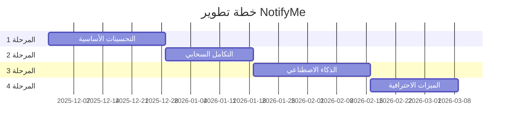

# 🗺️ خارطة طريق تطوير NotifyMe

## 📋 نظرة عامة

هذه الوثيقة تحتوي على الخطة الكاملة لتطوير مشروع NotifyMe من نسخة أساسية إلى منتج احترافي عالمي يواكب أفضل البرامج المنافسة.

---

## 🎯 الهدف الرئيسي

تطوير تطبيق مراقبة شبكة احترافي يتميز بـ:
- ✅ واجهة مستخدم عصرية وجذابة
- ✅ تحليلات متقدمة بالذكاء الاصطناعي
- ✅ تكامل سحابي ومزامنة عبر الأجهزة
- ✅ أمان وخصوصية عالية المستوى
- ✅ ميزات احترافية للشركات

---

## 📊 المراحل الأربعة

### [المرحلة 1️⃣: التحسينات الأساسية](file:///d:/Apps/C%23/NofiyMe/phase1_core_enhancement.md)
**المدة:** 3-4 أسابيع  
**الحالة:** 🔴 لم تبدأ

**الأهداف الرئيسية:**
- ✅ تطوير جميع الميزات الأساسية من الخطة الأصلية
- ✅ تطبيق واجهة مستخدم عصرية (Material Design)
- ✅ إضافة لوحة تحليلات متقدمة
- ✅ تتبع استهلاك كل تطبيق على حدة
- ✅ نظام تحديثات تلقائية
- ✅ تشفير البيانات والأمان

**الناتج المتوقع:** تطبيق كامل الوظائف بواجهة احترافية

---

### [المرحلة 2️⃣: التكامل السحابي والمزامنة](file:///d:/Apps/C%23/NofiyMe/phase2_cloud_sync.md)
**المدة:** 2-3 أسابيع  
**الحالة:** 🔴 لم تبدأ

**الأهداف الرئيسية:**
- ☁️ نظام حسابات المستخدمين
- ☁️ مزامنة البيانات عبر الأجهزة
- ☁️ لوحة تحكم ويب
- ☁️ إشعارات الهاتف المحمول
- ☁️ نسخ احتياطي واستعادة

**الناتج المتوقع:** تطبيق متصل بالسحابة مع إمكانية الوصول من أي مكان

---

### [المرحلة 3️⃣: الذكاء الاصطناعي والميزات المتقدمة](file:///d:/Apps/C%23/NofiyMe/phase3_ai_advanced.md)
**المدة:** 3-4 أسابيع  
**الحالة:** 🔴 لم تبدأ

**الأهداف الرئيسية:**
- 🤖 كشف الأنشطة الشاذة بالذكاء الاصطناعي
- 🤖 تنبيهات تنبؤية ذكية
- 🛡️ مراقبة أمن الشبكة
- 🔌 واجهة برمجية (API) و Webhooks
- 📱 دعم منصات متعددة

**الناتج المتوقع:** تطبيق ذكي يتميز عن جميع المنافسين

---

### [المرحلة 4️⃣: الميزات الاحترافية للشركات](file:///d:/Apps/C%23/NofiyMe/phase4_enterprise.md)
**المدة:** 2-3 أسابيع  
**الحالة:** 🔴 لم تبدأ

**الأهداف الرئيسية:**
- 🏢 دعم متعدد المستخدمين
- 🏢 المراقبة عن بُعد
- 🏢 إدارة الأجهزة المتعددة
- 🏢 تقارير متقدمة
- 🏢 الامتثال للخصوصية (GDPR)

**الناتج المتوقع:** حل احترافي كامل للشركات

---

## 📈 الجدول الزمني الإجمالي

**إجمالي المدة:** 10-14 أسبوع (2.5-3.5 شهر)

---

## 🎯 معايير النجاح

### المرحلة 1 ✅
- [ ] جميع الميزات الأساسية تعمل بشكل صحيح
- [ ] واجهة مستخدم عصرية وسلسة
- [ ] أداء ممتاز (أقل من 50MB ذاكرة)
- [ ] تقييم المستخدمين > 4.5/5

### المرحلة 2 ☁️
- [ ] مزامنة سلسة عبر الأجهزة
- [ ] لوحة ويب تعمل بكفاءة
- [ ] وقت استجابة API < 200ms
- [ ] نسبة uptime > 99.5%

### المرحلة 3 🤖
- [ ] دقة كشف الشذوذ > 90%
- [ ] تنبيهات ذكية مفيدة
- [ ] API موثق بالكامل
- [ ] دعم 3 منصات على الأقل

### المرحلة 4 🏢
- [ ] دعم 100+ مستخدم متزامن
- [ ] لوحة إدارة شاملة
- [ ] امتثال كامل لـ GDPR
- [ ] SLA 99.9%

---

## 📊 مقارنة التقدم

| الميزة | الحالي | بعد المرحلة 1 | بعد المرحلة 2 | بعد المرحلة 3 | بعد المرحلة 4 |
|-------|--------|---------------|---------------|---------------|---------------|
| الميزات الأساسية | 🟡 60% | ✅ 100% | ✅ 100% | ✅ 100% | ✅ 100% |
| واجهة المستخدم | 🟡 40% | ✅ 95% | ✅ 95% | ✅ 95% | ✅ 95% |
| التحليلات | ❌ 0% | ✅ 80% | ✅ 90% | ✅ 100% | ✅ 100% |
| التكامل السحابي | ❌ 0% | ❌ 0% | ✅ 100% | ✅ 100% | ✅ 100% |
| الذكاء الاصطناعي | ❌ 0% | ❌ 0% | ❌ 0% | ✅ 100% | ✅ 100% |
| ميزات احترافية | ❌ 0% | 🟡 20% | 🟡 30% | 🟡 50% | ✅ 100% |

---

## 💰 التكلفة المتوقعة

### خدمات سحابية (شهرياً)
- **Firebase/Azure:** $0 - $50 (حسب الاستخدام)
- **Domain & Hosting:** $5 - $15
- **Email Service:** $0 - $10
- **SMS/Notifications:** $0 - $20

**الإجمالي الشهري:** $5 - $95

### أدوات التطوير (مرة واحدة/سنوياً)
- **Visual Studio Pro:** مجاني (Community) أو $45/شهر
- **Azure Credits:** $200 مجاني للبداية
- **Icons/Assets:** $0 - $100

---

## 🎯 الأولويات

### ⭐ Must Have (المرحلة 1)
1. ✅ واجهة مستخدم عصرية
2. ✅ تحليلات بيانات متقدمة
3. ✅ تتبع التطبيقات
4. ✅ نظام تحديث تلقائي
5. ✅ أمان البيانات

### 🌟 Should Have (المرحلة 2-3)
1. ☁️ مزامنة سحابية
2. 🌐 لوحة ويب
3. 🤖 ذكاء اصطناعي
4. 📱 تطبيق محمول
5. 🔌 API عامة

### 💫 Nice to Have (المرحلة 4)
1. 🏢 ميزات الشركات
2. 🖥️ منصات متعددة
3. 📞 مراقبة عن بُعد
4. 🎮 التحكم بالسرعة
5. 🛡️ جدار حماية

---

## 📚 الموارد والمراجع

### الوثائق
- [المرحلة 1: التحسينات الأساسية](file:///d:/Apps/C%23/NofiyMe/phase1_core_enhancement.md)
- [المرحلة 2: التكامل السحابي](file:///d:/Apps/C%23/NofiyMe/phase2_cloud_sync.md)
- [المرحلة 3: الذكاء الاصطناعي](file:///d:/Apps/C%23/NofiyMe/phase3_ai_advanced.md)
- [المرحلة 4: الميزات الاحترافية](file:///d:/Apps/C%23/NofiyMe/phase4_enterprise.md)
- [الخطة الكاملة (v2)](file:///d:/Apps/C%23/NofiyMe/plan%20v2.md)

### مصادر التعلم
- [Microsoft Learn - WPF](https://learn.microsoft.com/en-us/dotnet/desktop/wpf/)
- [Microsoft Learn - Azure](https://learn.microsoft.com/en-us/azure/)
- [ML.NET Documentation](https://dotnet.microsoft.com/en-us/apps/machinelearning-ai/ml-dotnet)

---

## 📝 ملاحظات مهمة

> **تنبيه:** هذه الخطة مرنة ويمكن تعديلها بناءً على:
> - ملاحظات المستخدمين
> - التحديات التقنية
> - التغيرات في الأولويات
> - الموارد المتاحة

### نصائح للنجاح:
1. ✅ **ابدأ صغيراً** - ركز على إنجاز المرحلة 1 بجودة عالية
2. ✅ **اختبر مبكراً** - اطلب آراء المستخدمين في كل مرحلة
3. ✅ **وثّق كل شيء** - اكتب كود واضح ومُعلّق
4. ✅ **كن مرناً** - استعد لتغيير الخطة عند الحاجة
5. ✅ **احتفل بالإنجازات** - كل مرحلة منجزة هي نجاح!

---

## 🚀 البدء

### الخطوة التالية:
👉 **[افتح المرحلة 1: التحسينات الأساسية](file:///d:/Apps/C%23/NofiyMe/phase1_core_enhancement.md)**

عند الاستعداد للبدء في المرحلة 1، راجع الوثيقة التفصيلية واتبع الخطوات المحددة.

---

**تاريخ الإنشاء:** 30 نوفمبر 2025  
**الإصدار:** 2.0  
**آخر تحديث:** 30 نوفمبر 2025  
**الحالة:** 📋 جاهز للمراجعة
